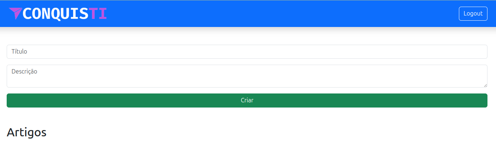

# Blog Simples

Este é um projeto front-end que consome uma API RESTful para gerenciar um blog. Ele permite que os usuários autentiquem-se, criem, editem e excluam artigos de forma dinâmica. A interface foi desenvolvida com **HTML**, **CSS** e **Bootstrap**, utilizando **JavaScript** para manipulação dos dados da API.

## Interface

<div align="center">
  
</div>

## Sumário

- [Tecnologias Utilizadas](#tecnologias-utilizadas)
- [Status](#status)
- [Descrição](#descrição)
- [Funcionalidades](#funcionalidades)
- [Explicação](#explicação)
- [Como Usar](#como-usar)
- [Autor](#autor)

## Tecnologias Utilizadas

<div style="display: flex; flex-direction: row;">
  <div style="margin-right: 20px; display: flex; justify-content: flex-start;">
    
  </div>
  <div style="margin-right: 20px; display: flex; justify-content: flex-start;">
    
  </div>
  <div style="margin-right: 20px; display: flex; justify-content: flex-start;">
    
  </div>
</div>

## Status


## Descrição

Este projeto foi criado para estudar a integração entre um front-end dinâmico e uma API RESTful. O objetivo principal é gerenciar artigos de blog com funcionalidades como autenticação, criação, edição e exclusão. O design é responsivo e utiliza o framework Bootstrap para simplificar a estilização.

## Funcionalidades

- Autenticação com login e gerenciamento de token.
- Criação de novos artigos com título e descrição.
- Edição de artigos existentes diretamente na interface.
- Exclusão de artigos com confirmação de ação.
- Atualização dinâmica da lista de artigos após cada ação.
- Gerenciamento de estado do usuário (login/logout).

## Explicação

A aplicação é dividida em duas páginas principais:

1. **Login**: Tela onde o usuário pode se autenticar na API utilizando credenciais válidas. Após o login, o token de autenticação é armazenado localmente para autorizar futuras requisições.
2. **Gerenciamento de Artigos**: Página principal onde o usuário pode visualizar, criar, editar e excluir artigos. As ações são realizadas por meio de requisições à API RESTful.

### Organização dos Arquivos

```plaintext
.
├── index.html
├── login.html
├── css/
│   ├── bootstrap.min.css
├── js/
│   ├── index.js
│   ├── bootstrap.bundle.min.js
└── img/
```

<!-- Usuario teste
teste@example.com
123456 -->

## Autor

Desenvolvido por Diego Franco.

<!--

5 Dicas para Melhorar o Desempenho de seu Código em JavaScript

Escrever código JavaScript eficiente é essencial para garantir uma boa performance em suas aplicações. Aqui estão cinco dicas práticas: 1) Use let e const adequadamente para evitar problemas com variáveis globais. 2) Reduza a complexidade utilizando funções puras e evitando loops desnecessários. 3) Prefira métodos como map, filter e reduce para manipular arrays de forma funcional. 4) Minimize manipulações diretas no DOM, pois elas podem ser custosas. 5) Use ferramentas como Webpack para otimizar seu código. Aplique essas práticas e veja sua aplicação rodar de forma mais eficiente!

---

O Que São APIs RESTful e Por Que Usá-las?

APIs RESTful são interfaces que permitem a comunicação entre diferentes sistemas usando os princípios REST (Representational State Transfer). Elas são amplamente utilizadas para conectar aplicativos front-end e back-end de maneira eficiente. Uma API bem construída segue práticas como usar verbos HTTP corretamente, organizar endpoints de forma intuitiva e retornar respostas claras e concisas. Se você está desenvolvendo sistemas modernos, entender e implementar APIs RESTful é essencial para criar aplicações escaláveis e modulares.

---

Como Escolher o Melhor Framework Front-End?

A escolha do framework front-end certo pode ser um desafio para desenvolvedores. React, Angular e Vue.js são os mais populares, mas cada um tem características distintas. React é ideal para projetos que exigem flexibilidade e alta personalização. Angular oferece uma solução completa, incluindo ferramentas para desenvolvimento de ponta a ponta. Vue.js é leve, fácil de aprender e perfeito para iniciantes. Antes de decidir, avalie o escopo do projeto, o tamanho da equipe e o nível de experiência em JavaScript. A escolha certa pode acelerar o desenvolvimento e melhorar a manutenção do código.

---

Introdução ao Git: Controle de Versão para Equipes de Desenvolvimento

Git é uma ferramenta essencial para gerenciar versões de código em equipes de desenvolvimento. Ele permite rastrear mudanças, colaborar de forma eficaz e evitar conflitos entre programadores. Com comandos simples como git init, git add e git commit, você pode criar repositórios e gerenciar alterações locais. Para trabalho em equipe, serviços como GitHub ou GitLab facilitam a hospedagem de repositórios remotos e o uso de pull requests para revisar e integrar código. Aprender Git é um passo fundamental para qualquer programador que deseje colaborar em projetos profissionais.

-->
